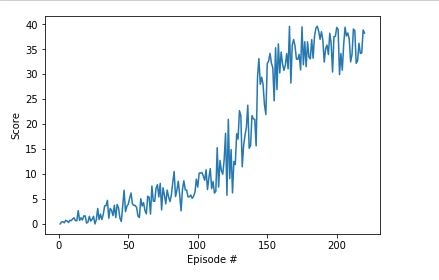

# Report

## Learning Algorithm

The learning algorithm is based on Udacity's implementation of ddpg. With some
small differences.

1) Turned down the sigma of the Ornstein-Uhlenbeck noise process from 0.2 to
0.1.
2) Decreased the learning rates of both the actor and the critic to 1e-4.
3) Initialised target and local networks of both the actor and the critic to
the same weights.

I also changed the neural network models of the local and target actors and 
critics in the following ways from the udacity bipedal implementation.

1) Tanh activation for the output of the actor.
2) 2 Batch norm layers between the linear layers in both the actor and the 
critic. (Seemed to help training a lot)
3) Leaky Relu activation in final linear layers. 
4) Size of 2 linear layers is 128 for both the actor and critic.

How did I come up with these values? Mostly trial and error and going through
the Udacity forum/chat. Still don't really have a feel for this if I'm honest.

## Plot of rewards

## Ideas for future work
Train with reacher 20. I wanted to do this but my algorithm is far flakier than
I expected. Small changes to these parameters will lead to failure. Would love
tips on how to make this more robust. I'd also like to incorporate some 
smarter sampling of replay memory.
